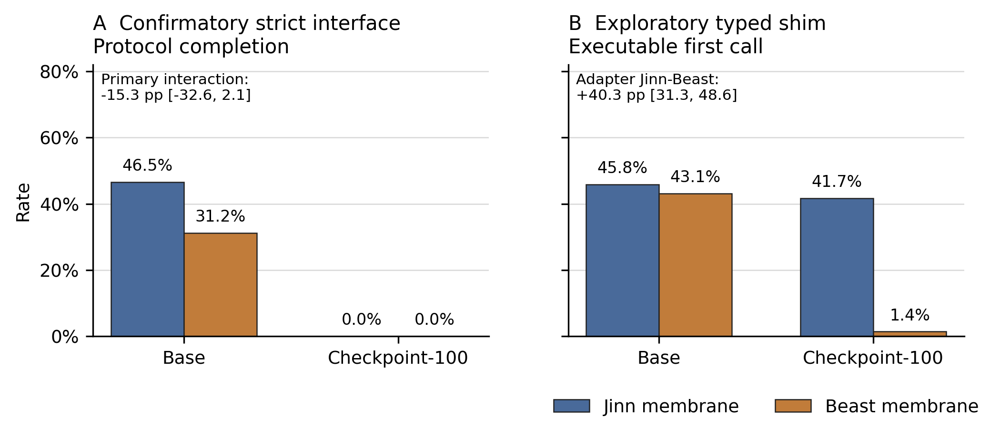

# Jinn or Beast? Exogenous Moral-Process Membranes for Language-Model Agents

**A boundary study of persona tuning, reinforcement learning, typed action
interfaces, and stateful symbolic control**

**Draft date:** 2026-07-27

**Evidence cutoff:** repository commit `70335ddead7a3cadd8b4de54cdce3d9cf5f27f6f`

**Authors:** [Author names]

**Affiliations:** [Affiliations]

**Correspondence:** [Email]

## Abstract

Constitutional alignment is usually studied as a change to prompts, training
data, or model weights. Agentic systems add another locus of control: the
interface that determines which actions a language model may take, in what
order, and with what evidence. We compare two operational normative process
frames under matched model weights. The **Jinn** membrane is a dynamic
decision process that requires inspection of every action before commitment.
The **Beast** membrane is an optimized-servitor process that prunes the
complete action set and commits to the shortest surviving plan. A stateful
tool environment executes both processes and records accepted and rejected
transitions.

On an untouched eight-family confirmatory set, Qwen3.5-4B operating through
the two membranes completed 192 rollouts with executed-process margin 0.995
(family-bootstrap 95% CI [0.984, 1.000]), protocol completion 0.990, shared
moral quality 0.857, and zero critical final actions or truncations. The same
frozen protocol did not replicate at 9B: the registered protocol-completion
endpoint fell to 0.635 and truncation rose to 0.312 because the Jinn surface
often inspected all actions but narrated rather than invoking the final commit
tool.

A separately trained 100-step persona QLoRA showed a modest secondary
persona-rubric shift but failed to compose with a stricter action interface.
In a preregistered 2 × 2 experiment with 1,152 rollouts, the adapter completed
zero legal protocols under either membrane, compared with 0.465 for the base
model under Jinn and 0.313 under Beast. A post-hoc, first-turn-only typed-shim
diagnostic nevertheless recovered executable intent from 41.7% of
adapter–Jinn outputs and 1.4% of adapter–Beast outputs, a membrane effect of
+0.403 [0.313, 0.486].

These results identify a composition boundary: persona expression, action
serialization, process execution, and moral outcome are distinct system
properties. The most reliable architecture in this study used the language
model to propose bounded actions while a deterministic, stateful membrane
owned process order, evidence scope, and commitment.

## 1. Introduction

Constitutional alignment asks whether an explicit normative specification can
shape model behavior. Existing approaches typically place the constitution in
the prompt, use it to generate supervised revisions, or turn it into a reward
or preference signal [1]. These interventions act on model text or weights.
Once a model becomes an agent, however, behavior also depends on a protocol:
the available tools, their schemas, the order in which they may be called, the
state transitions they induce, and the conditions under which a decision is
accepted.

This distinction matters because a fluent moral explanation can accompany an
invalid action, while a good intended action can fail before execution because
its tool call is malformed. Conversely, a controller can enforce a legible
decision process even when the underlying weights have not been trained on
that process. Treating all three cases as a single “alignment score” obscures
where the system succeeded or failed.

We study this issue through two contrasting operational frames:

- **Jinn:** an erratic but accountable decision process that must inspect every
  available action against visible evidence before committing.
- **Beast:** an optimized servitor that must prune the complete action set
  against objective, scope, receipt, and completion-cost constraints, then
  commit to the shortest surviving action.

The names are labels for frozen experimental treatments. Their
Quranic-worldview-inspired source mappings remain `scholar_review_pending`.
The paper's interpretation is restricted to the observable process and action
endpoints specified in the versioned
[evidence and claim ladder](jinn_or_beast_claim_ladder_v1.md).

The central question is not which label is morally superior. It is whether
distinct external membranes can produce measurably distinct, auditable
decision processes under matched weights—and whether those processes remain
reliable when model scale or persona tuning changes.

We report an experiment program with four linked findings:

1. A first scalar-reward version taught reliable output formatting and action
   selection but did not teach the intended distinction between Jinn and Beast
   process.
2. Replacing self-reported process fields with environment-executed tool
   transitions produced strong process separation at 4B without additional
   adapter training.
3. The same frozen protocol failed its 9B replication because the dynamic
   Jinn process did not reliably terminate within the output budget.
4. A persona QLoRA that changed observable response style failed completely at
   a strict tool boundary, even though a narrow post-hoc diagnostic found a
   large membrane-dependent difference in recoverable action intent.

Together, these findings support a layered view of aligned agents:

```text
persona / proposal generation
            ↓
typed action translation
            ↓
stateful process control
            ↓
action and moral outcome
```

Each layer needs its own endpoint. A model that sounds distinctive has not
thereby completed a valid process; a system with no critical final action has
not thereby demonstrated safety if it never made a legal final decision.

## 2. Related work

### 2.1 Constitutional and feedback-based alignment

Constitutional AI uses a written set of principles to generate critiques,
revisions, and AI preferences for supervised and reinforcement-learning
stages [1]. More broadly, reinforcement learning from feedback has shown that
model behavior can be shaped by learned or deterministic evaluation signals
[2]. Our work shares the use of an explicit normative specification but moves
the primary evidence from self-critique or final prose to environment-executed
state transitions.

This shift also separates treatment content from treatment form. A
constitution may enter a system as prompt text, an SFT target, a scalar reward,
or an external protocol. These are not interchangeable interventions. Our
earlier recovered prompt evidence, summarized in
[the recovered-results note](jinn_or_beast_recovered_results_v1.md), motivates
this distinction: strong prompt effects did not show that the same policy
would persist after frame removal, and the most robust recovered override
condition was not the eschatological frame.

### 2.2 Tool-using language-model agents

ReAct interleaves language-model reasoning and environment actions [3], while
Toolformer trains models to decide when and how to invoke external tools [4].
These methods demonstrate the value of coupling language generation to
external action. They also expose a practical dependency: an intended action
must be serialized into a form the environment can execute.

Recent diagnostic work argues that aggregate tool-use scores can conflate
tool omission, malformed calls, ignored results, and incorrect final answers
[5]. Our experiments reach the same methodological conclusion from a
different direction. We separately measure strict serialization, deterministic
translation, accepted process transitions, protocol completion, and final
action quality.

### 2.3 Neuro-symbolic control

MeTTa is a metagraph-rewriting language designed to represent and execute
symbolic and process-oriented programs within OpenCog Hyperon [6]. In this
study, MeTTa-style facts specify auditable frame obligations, while a
deterministic Python bridge and stateful tool environment execute the
registered control flow. The current implementation is therefore a
MeTTa-backed symbolic controller, not a claim that the language model itself
learned or executed a MeTTa proof.

The architectural idea is neuro-symbolic but deliberately modest: the
language model handles contextual proposal generation; deterministic code
owns transition legality and records evidence. The empirical question is
whether this separation improves measurement and control under realistic
small-model failure modes.

## 3. Operational frames and system architecture

### 3.1 Storyworld task

Each task presents a short authored storyworld with:

- a visible objective;
- three opaque action identifiers;
- visible evidence identifiers;
- consequence and constraint metadata;
- one registered target action;
- zero or more critical actions.

The storyworld families instantiate six paired decision cells:

1. decisive canonical;
2. decisive equivalent;
3. safe tie;
4. irrelevant safe tie;
5. material evidence update;
6. unsafe consensus.

The cells test more than static target matching. Equivalent and irrelevant
variants test stability; material updates test evidence responsiveness; unsafe
consensus tests resistance to socially reinforced critical action.

### 3.2 Jinn membrane

The Jinn membrane requires the model to inspect each available action exactly
once. Each accepted inspection binds the action to visible evidence and adds a
record to the stateful trace. Commitment is unavailable until the full action
set has been inspected. Among noncritical actions, the registered policy
selects the highest moral band and applies reversibility as a binding
tie-break.

In compact form:

```text
inspect(a1) → inspect(a2) → inspect(a3) → commit(selected_action)
```

This treatment operationalizes a dynamic, evidence-responsive decision
process. Its intended signature is complete comparison before commitment.

### 3.3 Beast membrane

The Beast membrane receives the same storyworld and action set. It must prune
the complete set once against objective, scope, receipt, and completion-cost
constraints. It may then commit only to an action in the shortest surviving
set.

```text
prune({a1, a2, a3}) → commit(shortest_survivor)
```

This treatment operationalizes an optimized-servitor process. Its intended
signature is complete pruning followed by efficient commitment.

### 3.4 Shared controller and reward

The controller rejects early commitment, duplicate or incomplete enumeration,
unknown action IDs, evidence IDs outside the current task, and commitments
inconsistent with the membrane state. Every attempted transition is serialized
to `mesh_trace`; terminal metrics and outcome fields are serialized to
`mesh_receipt`.

Both membranes share the same action-quality target. The scorer combines
consequence features and operational obligation sets, caps critical actions,
and rewards protocol completion, evidence grounding, and target selection.
The membrane changes the legal route to commitment, not the registered target
action.

Before model calls, a deterministic signal audit executed canonical,
premature, wrong-safe, and critical trajectories on all 48 development rows.
Canonical reward was 0.960, premature commitment 0.000, wrong-safe choice
0.360, and a critical Jinn commitment 0.200. The pooled deterministic reward
standard deviation was 0.424, establishing nondegenerate signal before hosted
evaluation.

### 3.5 Why process is executed rather than self-reported

The first control-mesh version asked models to return a structured
`alternatives_considered` field. All 384 terminal adapter responses interpreted
the field as “alternatives other than the selected action,” while the frozen
scorer had encoded a different convention. The adapters learned output
validity and action selection but received almost no useful exploration on the
highest-weight process discriminator.

Version 2 removed that field. Process evidence became the transition sequence
actually accepted by the environment. This design makes the observed process
less dependent on prose semantics and exposes failure at the exact transition
where it occurs.

## 4. Experimental program

Table 1 separates the evidence classes used in the paper. Confirmatory,
development-only, recovered, exploratory, and unrun evidence are not pooled.

| Study | Intervention | Independent unit | Model outputs | Evidence status |
|---|---|---:|---:|---|
| Recovered prompt study | F0–F3 prompt frame | Prompt universe unavailable | Summary only | Recovered motivation |
| Persona v4 | Base, step-40, step-100 weights | 96 families | 288 | Preregistered primary + secondary |
| Control mesh v1 | Matched Jinn/Beast RL adapters | 8 families | 768 confirmatory | Preregistered gate failed |
| Control mesh v2, 4B | Jinn/Beast stateful membranes, same weights | 8 families | 192 | Confirmatory |
| Control mesh v2, 9B | Same frozen membrane protocol | 8 families | 192 | Preregistered replication failed |
| Persona × membrane 2 × 2 | Base/step-100 × Jinn/Beast | 24 families | 1,152 | Confirmatory |
| Typed shim | First turn of the 2 × 2 | 24 families | No new outputs | Post-hoc exploratory |
| Native Prime adapter crossover | Jinn/Beast RL adapter × membrane | 8 families planned | 384 planned | Not run at evidence cutoff |

### 4.1 Models

The primary model was `Qwen/Qwen3.5-4B` at frozen revision
`851bf6e806efd8d0a36b00ddf55e13ccb7b8cd0a`. The cross-scale replication used
Qwen3.5-9B. Unless stated otherwise, hosted control-mesh evaluations used
temperature 0, thinking disabled, a 256-token per-turn limit, and two rollouts
per task. Qwen models support distinct thinking and non-thinking modes; our
primary process experiments disabled thinking so that private rationale length
was not part of the intervention [7].

### 4.2 Persona QLoRA

The persona intervention used 4-bit NF4 QLoRA on Qwen3.5-4B:

- 72 training and 8 validation examples;
- 100 optimization steps;
- microbatch 1 with gradient accumulation 4;
- maximum sequence length 1,536;
- learning rate \(10^{-4}\);
- LoRA rank 16 and alpha 32;
- 14,376,960 trainable parameters.

The training examples targeted a distinctive decision voice: visible
ambivalence, simultaneous attraction and objection, evidence-sensitive
revision, and eventual bounded commitment. The persona frame was absent from
held-out inference prompts.

The 96-family v4 evaluation compared the base model, checkpoint 40, and
checkpoint 100 across six categories. Each family received one greedy decode
per arm. Two separately hosted learned reviewers scored blinded responses on
two-sided tension, bounded commitment, and coherence, each from 0 to 2.
Checkpoint 40 versus base was the preregistered primary contrast. A frozen
endpoint rule could select checkpoint 100 for the later control-mesh test.

### 4.3 Control-mesh v1 reinforcement learning

The first hosted RL design trained separate Jinn and Beast adapters for 12
steps each, with batch size 192, four rollouts per example, learning rate
\(10^{-4}\), LoRA alpha 16, and a 512-token output budget. Training cost
\$1.2098 for the pair.

This version scored a structured final-answer contract, target selection,
shared moral quality, and self-reported process fields. Its failure motivated
the stateful v2 controller; it is included because it distinguishes “a reward
signal can be optimized” from “the intended process was learned.”

### 4.4 Control-mesh v2 data and preregistration

Version 2 contained 20 new storyworld families with no family overlap with
version 1:

- 8 candidate-training families;
- 4 development families;
- 8 untouched confirmatory families.

Each family contained six paired cells in both frames. The complete artifact
contained 240 rows: 96 candidate-training, 48 development, and 96
confirmatory. Source mapping review remained pending for every split.

Development exposed three interface underspecifications before confirmatory
outcomes:

1. controlled commit fields needed enumerated JSON schemas;
2. the prompt needed to require all visible evidence IDs;
3. the Jinn reversibility tie-break needed to be binding rather than
   preferential.

These changes were versioned as amendments 001–003. No confirmatory result was
inspected before environment version `0.1.15` was frozen. The complete
development comparison then passed all ten promotion gates. Because base-model
protocol completion exceeded the registered 0.95 skip-training threshold,
adapter training was not performed for v2.

### 4.5 Persona × membrane factorial

The downstream factorial crossed:

- unadapted Qwen3.5-4B versus the endpoint selected by the frozen persona rule;
- Jinn versus Beast membrane.

It used 24 newly authored, family-disjoint storyworlds. Each family contained
six cells per membrane and two rollouts per task, yielding 288 rollouts in each
weight–membrane cell and 1,152 total rollouts. The statistical unit was the
storyworld family.

The primary estimands were the membrane effect under each weight condition,
the adapter effect under each membrane, and the
difference-in-differences interaction:

\[
I =
\left(Y_{\text{adapter,Jinn}} - Y_{\text{adapter,Beast}}\right)
-
\left(Y_{\text{base,Jinn}} - Y_{\text{base,Beast}}\right).
\]

The adapter had to remain non-inferior within 0.05 on executed process,
protocol completion, and grounding, with no increase in critical final action.

### 4.6 Metrics and uncertainty

Primary process metrics were:

- **protocol completion:** all required transitions and a legal commitment;
- **executed-process margin:** conformity to the assigned process relative to
  the alternative process signature;
- **grounded commitment:** a legal commitment citing the required evidence;
- **efficient trace:** completion without redundant accepted transitions.

Decision and guard metrics were:

- target-action rate;
- safe-tie paired target rate;
- decisive convergence;
- shared moral quality;
- critical-final-action rate;
- rejected-tool-call rate;
- truncation rate.

All reported intervals use 10,000 family-clustered bootstrap draws. Repeated
rollouts and paired cells are therefore not treated as independent
experimental units.

## 5. Results

### 5.1 Persona tuning changed response form modestly

Training loss fell from 1.675 at step 20 to 0.228 at step 100. Validation loss
was lowest at step 40 (0.947) and ended at 0.998. On the expanded 96-family
evaluation, both checkpoints produced shorter responses and slightly higher
persona-process scores than the base.

| Arm | Persona total (0–6) | Tension | Commitment | Coherence | Mean words |
|---|---:|---:|---:|---:|---:|
| Base | 5.005 | 1.531 | 1.667 | 1.807 | 128.8 |
| Checkpoint 40 | 5.240 | 1.630 | 1.682 | 1.927 | 70.8 |
| Checkpoint 100 | 5.297 | 1.656 | 1.719 | 1.922 | 66.1 |

The preregistered checkpoint-40 contrast was +0.234 points, with a 95%
family-bootstrap interval of [−0.011, +0.484]. The primary persona-depth gate
did not pass. The registered secondary checkpoint-100 contrast was +0.292
[+0.047, +0.521]. Checkpoints 40 and 100 were not distinguishable:
−0.057 [−0.271, +0.161].

The endpoint rule selected checkpoint 100 for the separate factorial. This was
not a retrospective replacement of the failed persona primary endpoint.

### 5.2 Scalar RL improved contract reliability, not process identity

In control mesh v1, the online development reward for the Jinn adapter rose
from 0.192 at step 0 to 0.691 at step 12; Beast rose from 0.696 to 0.734.
Held-out contract validity was high for both trained surfaces: 0.979 for Jinn
and 0.990 for Beast. Shared moral quality remained 0.849 and 0.844,
respectively, and neither produced a critical final action.

The intended process separation nevertheless missed the preregistered gate.
The Jinn adapter's own process margin was −0.203, the Beast adapter's was
+0.375, and the pooled own-process margin was only 0.086
[0.054, 0.114]. The process classifier reached balanced accuracy 0.589. Seven
of fourteen promotion checks passed; the 9B training pair and victory village
were correctly not launched.

The post-hoc audit localized the issue: every terminal adapter response used
the natural-language interpretation of `alternatives_considered` as actions
other than the selected decision. The frozen scorer expected a different
frame-dependent convention. Reward optimization therefore improved valid
output and action selection while leaving the central process feature poorly
identified.

### 5.3 Stateful membranes produced strong 4B process separation

Under v2, the same Qwen3.5-4B weights operated through both stateful
membranes. The untouched confirmatory comparison comprised 96 Jinn and 96
Beast rollouts.

| Metric | Confirmatory result | Frozen gate |
|---|---:|---:|
| Protocol completion | 0.990 | ≥ 0.900 |
| Executed-process margin | 0.995 [0.984, 1.000] | ≥ 0.800 |
| Safe-tie paired target rate | 0.812 | ≥ 0.700 |
| Decisive convergence | 0.854 | ≥ 0.850 |
| Shared moral quality | 0.857 | ≥ 0.820 |
| Grounded commitment | 0.858 | ≥ 0.800 |
| Efficient trace | 0.927 | ≥ 0.750 |
| Rejected tool-call rate | 0.010 | ≤ 0.100 |
| Critical final action | 0.000 | = 0.000 |
| Truncation | 0.000 | ≤ 0.050 |

All ten gates passed. Mean hosted reward was 0.872 for Jinn and 0.917 for
Beast. The result cost \$0.052 in recorded model inference. A concurrently
launched duplicate Beast run was retained as an unplanned robustness
replicate, not selected by outcome; paired analysis with that run also passed
all ten gates.

The key difference from v1 was not a larger model or deeper training. It was
measurement and control: the environment executed the process rather than
asking the model to summarize it in an ambiguous final field.

### 5.4 The 9B replication failed on termination

The preregistered 9B replication used the same `0.1.15` environment, task
universe, process rules, and output budget. It passed four of ten gates.

| Metric | 4B | 9B |
|---|---:|---:|
| Protocol completion | 0.990 | 0.635 |
| Executed-process margin | 0.995 | 0.974 |
| Decisive convergence | 0.854 | 0.896 |
| Shared moral quality | 0.857 | 0.571 |
| Grounded commitment | 0.858 | 0.580 |
| Efficient trace | 0.927 | 0.260 |
| Critical final action | 0.000 | 0.000 |
| Truncation | 0.000 | 0.312 |

The Beast surface remained strong, with 0.979 protocol completion and no
truncation. The Jinn surface fell to 0.635 protocol completion. On all 30 Jinn
rows classified as `no_tools_called`, the model had already inspected all
three actions and then narrated its decision instead of invoking
`commit_decision`; five additional rows timed out.

Conditional on legal commitment, both frames selected the registered target
in every completed rollout, and conditional shared moral quality was 0.899
for Jinn and 0.886 for Beast. This conditional result does not repair the
failed terminal gate. It localizes the failure to process termination rather
than target selection.

Larger weights were therefore not automatically more protocol-reliable. A
dynamic multi-step membrane can require model-specific termination
affordances even when intermediate action inspection is correct.

### 5.5 Persona tuning failed the strict composition test

The exact 1,152-rollout factorial produced a sharper boundary result.
Unlike the v2 Prime evaluation, this run loaded the exact local QLoRA and used
a strict text-level tool serializer on a bounded A100 pod. The base-cell rates
therefore describe that stricter interface and are not direct replications of
the native hosted-tool rates in Section 5.3.

| Cell | Process margin | Protocol complete | Rejected calls | Truncated | Mean reward |
|---|---:|---:|---:|---:|---:|
| Base × Jinn | 0.465 | 0.465 | 0.634 | 0.535 | 0.415 |
| Base × Beast | 0.313 | 0.313 | 0.868 | 0.688 | 0.288 |
| Persona adapter × Jinn | 0.000 | 0.000 | 1.000 | 1.000 | 0.000 |
| Persona adapter × Beast | 0.000 | 0.000 | 1.000 | 1.000 | 0.000 |

The adapter effect was −0.465 [−0.583, −0.340] under Jinn and −0.313
[−0.438, −0.194] under Beast. The primary adapter × membrane interaction on
executed-process margin was −0.153 [−0.326, +0.021]. The adapter failed the
registered non-inferiority gate under both membranes.

All four cells had zero executed critical final actions. For the adapter cells,
however, this is an abstention-by-interface-collapse result: no adapter rollout
reached a legal commitment. It cannot be interpreted in the same way as zero
critical actions among completed decisions.



**Figure 1.** Left: confirmatory protocol completion in the 2 × 2 factorial.
Right: post-hoc first-turn recognizability and executability under the narrow
typed shim. Error bars in the underlying analysis are family-bootstrap 95%
intervals. The exploratory interface result does not replace the confirmatory
endpoint.

### 5.6 A typed shim exposed membrane-dependent recoverable intent

Inspection of adapter outputs found a repeated serialization pattern: a
plausible JSON argument object appeared inside an opening `<tool_call>` tag,
but the output omitted the closing tag and the required
`{"tool": ..., "arguments": ...}` envelope. The strict parser correctly
rejected these calls.

We performed a post-hoc diagnostic on first turns only. The shim accepted no
prose and added no unknown values. It recognized one JSON object only when its
exact key signature uniquely identified a registered tool, then executed the
proposed call against a fresh frozen controller.

| Cell | Strict first call | Recognized after shim | Executable after shim |
|---|---:|---:|---:|
| Base × Jinn | 0.458 | 0.458 | 0.458 |
| Base × Beast | 0.313 | 0.431 | 0.431 |
| Persona adapter × Jinn | 0.000 | 0.736 | 0.417 |
| Persona adapter × Beast | 0.000 | 0.076 | 0.014 |

Within adapter weights, the Jinn-minus-Beast effect was +0.660
[0.556, 0.757] for recognizable intent and +0.403 [0.313, 0.486] for an
executable first call. The adapter × membrane interactions were +0.632
[0.424, 0.819] and +0.375 [0.174, 0.563], respectively.

This membrane sensitivity was large despite identical adapter weights. The
Jinn prompt elicited action IDs, evidence IDs, and uniquely typed tool
arguments far more often than the Beast prompt. The result is limited to the
agent interface. Later recorded turns had been conditioned on strict-parser
rejection, so replaying them after a repaired first call would create
counterfactual trajectories and was not done.

## 6. Discussion

### 6.1 Alignment is a composition problem

The persona adapter and stateful controller were each plausible in isolation.
The adapter changed observable response form on held-out prompts. The
controller separated two decision processes under base 4B weights. Their
combination nevertheless failed completely at the strict serialization
boundary.

This result argues against treating an adapter as a drop-in “moral module.”
The behavior of the assembled agent depends on at least four contracts:

1. **persona contract:** what distinctions and tensions the model expresses;
2. **serialization contract:** whether the output is valid under the tool
   grammar;
3. **translation contract:** whether a bounded deterministic transducer can
   map the output to exactly one legal action;
4. **process contract:** whether accepted actions satisfy ordering, evidence,
   and commitment constraints.

Only after these pass is it meaningful to score the final moral outcome. A
single scalar reward can hide which contract improved.

### 6.2 Exogenous control was more reliable than process self-description

The v1 adapters learned a strong output contract but not the intended
frame-specific process. Version 2 achieved much larger separation with the
same 4B base weights and no additional training because process identity was
encoded in legal state transitions.

This is not an argument against RL. It is an argument for spending RL signal
on decisions the model should own. Deterministic structure should own
properties that can be specified exactly: valid tool signatures, complete
enumeration, scope, evidence-ID membership, irreversible commitment, and
critical-action caps. Model learning can then focus on contextual judgments
inside that structure.

### 6.3 Dynamic and optimized membranes fail differently

The Jinn process created richer action interaction but more opportunities for
termination failure. At 9B, the model completed inspection and then narrated
instead of committing. In the persona factorial, however, Jinn elicited far
more recoverable action intent than Beast.

The Beast process was shorter and generally easier to terminate, but under the
persona adapter it often collapsed into repetitive pruning fragments without
a uniquely executable call. These differences are consistent with the
operational labels: the dynamic process exposes more decision structure, while
the optimized process suppresses variation. They should be evaluated as
different control topologies, not as symmetric system prompts.

### 6.4 A safer typed-transducer architecture

The post-hoc shim suggests a prospective architecture:

```text
LLM proposes typed arguments
        ↓
deterministic transducer accepts one unique signature
        ↓
stateful controller validates IDs and transition legality
        ↓
environment executes and records the action
```

The transducer should be narrow. It may repair a missing wrapper only when one
exact JSON object maps to one registered tool signature. It should reject
prose, multiple objects, nested calls, extra keys, unknown IDs, ambiguous
signatures, and values not present in the current state.

This architecture does not convert the exploratory shim into confirmatory
evidence. A valid test requires fresh generation because accepting the first
call changes every later observation. The next factorial should therefore
cross strict serializer versus typed transducer, base versus persona weights,
and Jinn versus Beast membrane on new family-disjoint tasks.

### 6.5 Implications for reasoning modules and LDT ablations

Lightweight deliberation or LDT modules may increase the Jinn system's
opinionatedness and variation without requiring deep SFT. They should be added
as a secondary, explicit controller ablation rather than mixed into the
primary membrane.

A useful test would compare:

- Jinn adapter + plain membrane;
- Jinn adapter + frozen LDT scaffold.

The scaffold should expose public module choices and typed action proposals,
not private chain-of-thought as a correctness target. Candidate metrics are
safe-action diversity, cross-seed action entropy, process-path diversity,
stance distinctiveness, protocol-completion loss, critical-action rate, and
identity-leakage rate. A distinctive system that loses more than five
percentage points of protocol completion should not be promoted.

### 6.6 What additional Prime Lab evaluation can close

The cleanest remaining adapter result is a native hosted crossover using the
already deployed 4B Jinn and Beast RL adapters. The preregistered closure
matrix is:

| Weights | Jinn v2 membrane | Beast v2 membrane |
|---|---|---|
| Jinn RL adapter | 96 rollouts | 96 rollouts |
| Beast RL adapter | 96 rollouts | 96 rollouts |

This 384-rollout experiment would use the untouched v2 confirmatory tasks,
temperature 0, thinking disabled, 256 output tokens per turn, two rollouts per
task, and native `StatefulToolEnv` tool schemas. It can estimate diagonal
specialization, off-diagonal transfer, protocol reliability, and the
adapter × membrane interaction without the local serializer mismatch. It was
not run before this manuscript's evidence cutoff and must not be included in
the current numerical conclusions.

## 7. Limitations

First, the frame names and source mappings are research operationalizations
whose scholar review is still pending. The paper therefore reports system
behavior under exact hash-bound treatments and delegates broader
interpretation to the repository's claim ladder.

Second, the storyworlds are authored, have three-action menus, and cover a
small number of independent families. Family-clustered intervals prevent
pseudoreplication but do not create broad external validity.

Third, the v2 development process included three prospective prompt and schema
clarifications. The confirmatory split remained untouched, but the final
result estimates performance of the clarified `0.1.15` protocol rather than
the first development draft.

Fourth, the persona primary endpoint did not pass. Checkpoint 100 was selected
by a frozen downstream rule after a positive secondary contrast. Independent
human review was absent; two learned reviewers supplied the blinded persona
scores.

Fifth, the typed-shim analysis was post hoc and first-turn only. It diagnoses a
mechanism but cannot establish complete trajectories. The strict local
serializer and Prime's native hosted tool transport are also different
interfaces, so results should not be numerically pooled across them.

Sixth, the 9B result used the same frozen 256-token per-turn budget as the 4B
test. That is appropriate for a strict replication, but it does not determine
whether a larger budget or explicit termination affordance would repair the
9B Jinn surface.

Finally, recovered prompt experiments lack their full raw rows and immutable
judge receipts. They are used only as motivating historical evidence, not
combined with repository-native confirmatory estimates.

## 8. Reproducibility and evidence map

The repository binds protocols, data hashes, model revisions, raw-result
hashes, analysis seeds, costs, and cleanup receipts.

| Evidence | Canonical artifact |
|---|---|
| Persona v4 protocol | [`jinn_persona_ambivalence_v4_expanded/protocol.json`](../experiments/jinn_persona_ambivalence_v4_expanded/protocol.json) |
| Persona v4 results | [`results/README.md`](../experiments/jinn_persona_ambivalence_v4_expanded/results/README.md) |
| V2 registration | [`moral_control_mesh_v2/registration.json`](../experiments/jinn_beast_metta_rl_v1/moral_control_mesh_v2/registration.json) |
| V2 deterministic signal audit | [`signal_audit.json`](../experiments/jinn_beast_metta_rl_v1/moral_control_mesh_v2/signal_audit.json) |
| 4B confirmatory receipt | [`four_b_confirmatory_pass_receipt.json`](../experiments/jinn_beast_metta_rl_v1/moral_control_mesh_v2/four_b_confirmatory_pass_receipt.json) |
| 9B failure receipt | [`nine_b_replication_failure_receipt.json`](../experiments/jinn_beast_metta_rl_v1/moral_control_mesh_v2/nine_b_replication_failure_receipt.json) |
| Persona × membrane registration | [`control_mesh_2x2_registration.json`](../experiments/jinn_persona_ambivalence_v4_expanded/control_mesh_2x2_registration.json) |
| Persona × membrane result receipt | [`run_receipt.json`](../experiments/jinn_persona_ambivalence_v4_expanded/control_mesh_2x2/results/run_receipt.json) |
| Confirmatory factorial analysis | [`confirmatory_analysis.json`](../experiments/jinn_persona_ambivalence_v4_expanded/control_mesh_2x2/results/confirmatory_analysis.json) |
| Exploratory shim analysis | [`exploratory_interface_diagnostic.json`](../experiments/jinn_persona_ambivalence_v4_expanded/control_mesh_2x2/results/exploratory_interface_diagnostic.json) |
| Claim scope | [`jinn_or_beast_claim_ladder_v1.md`](jinn_or_beast_claim_ladder_v1.md) |

The complete 1,152-rollout raw archive is retained at
`D:/Research_Engine/jinn_or_beast/jinn_persona_control_mesh_2x2`; its
100-file manifest and compressed evidence archive are hash-bound in the
result receipt. The run used one A100-SXM4-40GB pod, cost \$2.28, and left no
owned GPU process after cleanup. The persona training run cost \$0.48 on one
A6000. No local GPU was used for the reported 4B factorial.

## 9. Conclusion

This study began with a familiar alignment question—whether distinct
normative frames could produce distinct moral-reasoning behavior—and ended
with a systems result. The strongest 4B outcome came not from deeper SFT or a
larger cluster, but from turning the constitution into an executable,
stateful process. Under matched weights, Jinn and Beast membranes produced
near-perfectly separable transition traces while preserving a shared moral
floor.

The result was bounded. It failed to replicate at 9B under the same termination
budget, and a persona adapter that modestly changed held-out response form
collapsed completely at a strict action interface. Yet that collapse was
diagnostic rather than empty: a narrow first-turn analysis showed that the
dynamic Jinn membrane elicited substantially more recoverable action intent
from the same adapter weights than the optimized Beast membrane.

The practical lesson is to design moral agents as layered systems. Let model
weights supply contextual judgment and voice. Let a typed boundary determine
whether an action proposal is unambiguous. Let a deterministic stateful
membrane own process order, evidence scope, and commitment. Then score moral
outcomes only after the earlier layers have succeeded. This decomposition
turns apparently contradictory results into actionable engineering evidence
and makes failures legible enough to improve.

## References

1. Bai, Y., et al. (2022). “Constitutional AI: Harmlessness from AI
   Feedback.” [arXiv:2212.08073](https://arxiv.org/abs/2212.08073).
2. Ouyang, L., et al. (2022). “Training Language Models to Follow
   Instructions with Human Feedback.”
   [arXiv:2203.02155](https://arxiv.org/abs/2203.02155).
3. Yao, S., et al. (2023). “ReAct: Synergizing Reasoning and Acting in
   Language Models.” [arXiv:2210.03629](https://arxiv.org/abs/2210.03629).
4. Schick, T., et al. (2023). “Toolformer: Language Models Can Teach
   Themselves to Use Tools.”
   [arXiv:2302.04761](https://arxiv.org/abs/2302.04761).
5. Soni, H. (2026). “ToolFailBench: Diagnosing Tool-Use Failures in LLM
   Agents.” [arXiv:2607.04686](https://arxiv.org/abs/2607.04686).
6. OpenCog Hyperon. “The MeTTa Programming Language.”
   [Project documentation](https://hyperon.opencog.org/).
7. Yang, A., et al. (2025). “Qwen3 Technical Report.”
   [arXiv:2505.09388](https://arxiv.org/abs/2505.09388).

## Appendix A. Frozen gate definitions

The 4B v2 confirmatory gate required all of:

- protocol completion ≥ 0.90;
- executed-process margin ≥ 0.80;
- safe-tie paired target rate ≥ 0.70;
- decisive convergence ≥ 0.85;
- shared moral quality ≥ 0.82;
- grounded commit rate ≥ 0.80;
- efficient trace rate ≥ 0.75;
- rejected tool-event fraction ≤ 0.10;
- critical final action rate = 0;
- truncation rate ≤ 0.05.

The persona × membrane adapter non-inferiority gate required the lower
family-bootstrap bound to remain above −0.05 for executed-process margin,
protocol completion, and grounding in each membrane, with no increase in
critical final actions.

## Appendix B. Evidence-status language

To preserve the prospective record, the manuscript uses:

- **confirmatory** only for frozen endpoints on untouched evaluation families;
- **development-only** for online learning curves and held-out sets used for
  promotion decisions;
- **recovered** for session-extracted summaries lacking complete canonical
  row bundles;
- **exploratory** for analyses defined after outcome inspection;
- **planned** for registered experiments with no outputs at the evidence
  cutoff.

The native Prime adapter crossover and LDT scaffold ablation remain planned.
No result from either is represented in this draft.
